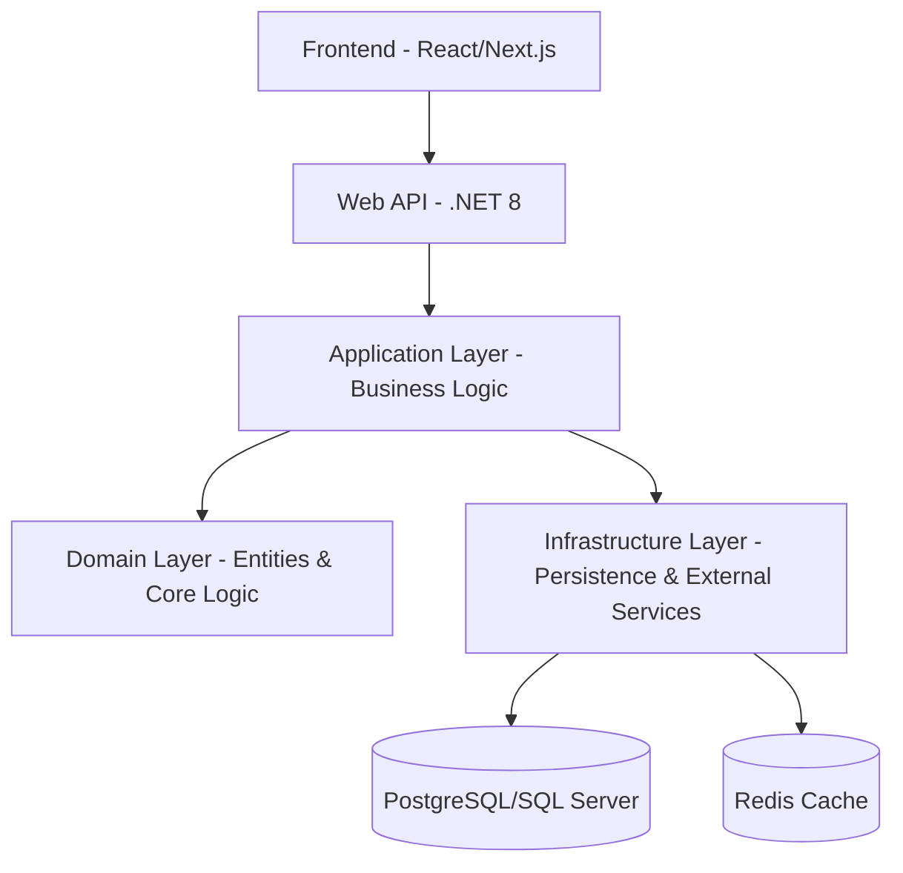

# 🏆 SmartSport - Nền tảng Đặt sân Thể thao Thông minh

[](https://dotnet.microsoft.com/)
[](https://blog.cleancoder.com/uncle-bob/2012/08/13/the-clean-architecture.html)
[](https://redis.io/)
[](https://learn.microsoft.com/en-us/aspnet/core/signalr/introduction)

**SmartSport** là hệ thống quản lý và đặt sân thể thao (Bóng đá, Cầu lông, Tennis...) hiện đại, được xây dựng trên nền tảng .NET 8 với kiến trúc Clean Architecture chuyên nghiệp. Dự án không chỉ giải quyết bài toán đặt sân cơ bản mà còn tích hợp các tính năng thông minh vượt trội như AI Recommendation, QR Check-in và Dynamic Pricing.

---

## ✨ Tính năng Nổi bật (Core Features)

### 🤖 Trí tuệ Nhân tạo & Cá nhân hóa
- **Smart Recommendation**: Gợi ý sân thông minh dựa trên lịch sử hoạt động, vị trí và khung giờ chơi yêu thích của người dùng.
- **AI Chatbot Support**: Tích hợp Google Gemini để tư vấn chọn sân và giải đáp thắc mắc 24/7.

### 💰 Kinh doanh & Thanh toán
- **Dynamic Pricing**: Tự động điều chỉnh giá theo giờ cao điểm (Peak hours), giờ thấp điểm (Off-peak) và cuối tuần.
- **Booking Deposit**: Hệ thống đặt cọc linh hoạt giúp giảm tỷ lệ "boom" hàng.
- **VNPAY Integration**: Thanh toán trực tuyến an toàn, nhanh chóng và tự động hoàn tiền khi hủy lịch đúng quy định.

### ⚡ Kỹ thuật Xuất sắc
- **QR Check-in**: Tự động sinh mã QR xác thực gửi qua Email ngay sau khi đặt sân thành công.
- **Real-time Status**: Cập nhật trạng thái sân tức thì (đang đặt, đã khóa, trống) thông qua SignalR.
- **Waitlist System**: Hàng chờ tự động thông báo cho người dùng khi có khung giờ trống do người khác hủy.
- **High Performance**: Sử dụng Redis Caching để tối ưu tốc độ truy vấn khung giờ và giảm tải cho Database.

---

## 🏗️ Kiến trúc Hệ thống (Architecture)

Dự án tuân thủ nghiêm ngặt nguyên lý **Clean Architecture** kết hợp với **Domain-Driven Design (DDD)** và mô hình **CQRS (MediatR)**.

### Cấu trúc Thư mục:
```
server/
├── Domain/              # Business Logic Core (Entities, Value Objects, Enums)
├── Application/         # Use Cases (CQRS Commands/Queries, Services, Interfaces)
├── Infrastructure/      # Persistence (EF Core, Redis, SMTP, External APIs)
└── Api/                # Presentation Layer (Controllers, Hubs, Middlewares)
```

### Sơ đồ luồng:


---

## 🛠️ Hướng dẫn Cài đặt (Getting Started)

### Yêu cầu hệ thống:
- .NET 8 SDK
- SQL Server (LocalDB hoặc SQL Server instance)
- Redis Server (Optional, mặc định sử dụng nếu được cấu hình)

### Các bước thực hiện:
1. **Clone repository**:
   ```bash
   git clone https://github.com/nglowji/graduation-project-SmartSport.git
   ```
2. **Cài đặt Database**: Cập nhật ConnectionString trong `appsettings.json` (Api project).
3. **Chạy Migration**:
   ```bash
   cd server/Infrastructure
   dotnet ef database update --startup-project ../Api
   ```
4. **Khởi chạy ứng dụng**:
   ```bash
   cd ../Api
   dotnet run
   ```

---

## 🧪 Kiểm thử (Testing)

Dự án chú trọng vào chất lượng mã nguồn với bộ Unit Test bao phủ các logic quan trọng:
```bash
dotnet test server/Tests/Application.UnitTests
```

---

## 📚 Tài liệu chi tiết
Các tài liệu hướng dẫn chi tiết được lưu trữ trong thư mục `/docs`:
- [📌 Trạng thái dự án](./docs/ProjectStatus.md)
- [✨ Danh sách tính năng](./docs/Features.md)
- [💳 Tích hợp thanh toán](./docs/PaymentIntegration.md)
- [📋 Danh sách công việc (Todo)](./docs/Todo.md)

---

## 📝 Giấy phép (License)
Dự án được thực hiện phục vụ mục đích Đồ án Tốt nghiệp. Mọi hành vi sao chép vui lòng ghi rõ nguồn.

**Tác giả**: Nguyễn Tấn Lợi
**Email**: nglowji@example.com
