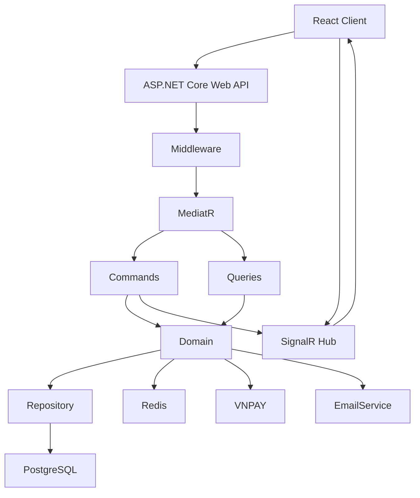
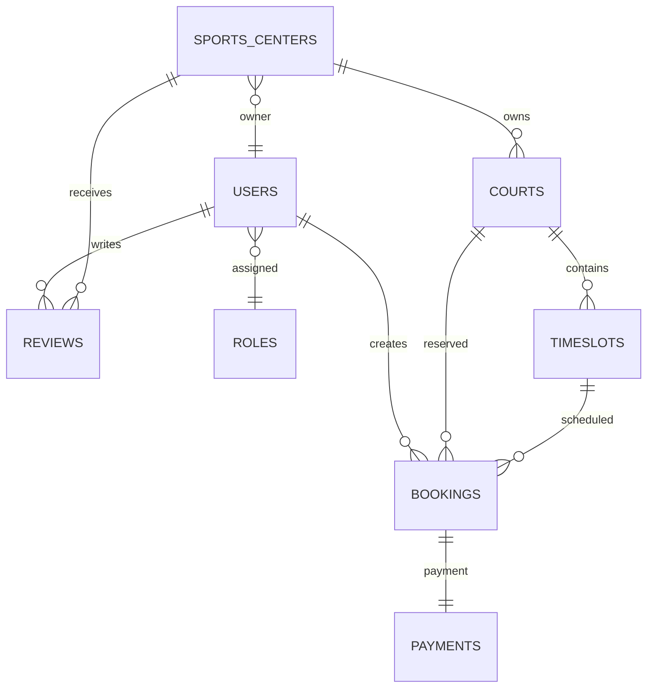
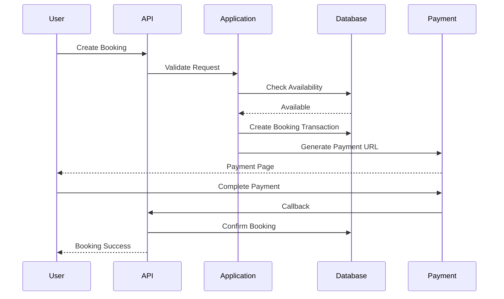

# SmartSport

Sports Booking & Facility Management Platform built with **ASP.NET Core (.NET 8)**, following **Clean Architecture**, **Domain-Driven Design (DDD)**, and **CQRS** principles.

## Overview

SmartSport is a full-featured sports facility booking and management platform designed to simplify the reservation process for customers while providing comprehensive management tools for venue owners and administrators.

The project focuses on building a scalable and maintainable backend architecture by applying enterprise software engineering practices, including Clean Architecture, CQRS, Domain-Driven Design, Redis caching, real-time communication, secure authentication, and payment integration.

The system supports the complete booking lifecycle, from searching for available courts and online payment to real-time booking synchronization and facility management.

---

## Project Status

Current Version: **v1.0.0**

| Module | Status |
|----------|--------|
| Authentication & Authorization | Completed |
| User Management | Completed |
| Sports Center Management | Completed |
| Court Management | Completed |
| Booking Management | Completed |
| Booking History | Completed |
| Online Payment (VNPAY) | Completed |
| Review & Rating | Completed |
| Notification System | Completed |
| SignalR Real-Time Communication | Completed |
| Redis Caching | Completed |
| Email Service | Completed |
| RESTful API | Completed |
| Automated Testing | Completed |

**Project Completion: 100%**

---

# Features

## Customer

- User registration and authentication
- JWT Authentication with Refresh Token
- Search and filter sports centers
- Browse available courts
- Court booking
- Booking history
- Online payment via VNPAY
- Booking cancellation
- Review and rating
- Real-time booking updates

## Venue Owner

- Sports center management
- Court management
- Time slot configuration
- Pricing management
- Booking monitoring
- Revenue overview
- Customer review management

## Administrator

- User management
- Role and permission management
- Sports center approval
- Booking supervision
- System monitoring
- Notification management

---

# System Architecture

SmartSport follows the Clean Architecture pattern to achieve separation of concerns, maintainability, scalability, and testability.


```mermaid
flowchart TD

Client[React Client]

Client --> API[ASP.NET Core Web API]
Client --> Hub[SignalR Hub]

API --> Middleware

Middleware --> MediatR

MediatR --> Commands
MediatR --> Queries

Commands --> Domain
Queries --> Domain

Domain --> Repository

Repository --> PostgreSQL

Domain --> Redis

Domain --> VNPAY

Domain --> EmailService

Commands --> Hub

Hub --> Client
```

---

# Clean Architecture

## Presentation Layer

### Responsibilities

- RESTful APIs
- SignalR Hubs
- Middleware
- Authentication
- Request and Response handling

### Technologies

- ASP.NET Core Web API
- Swagger
- SignalR

---

## Application Layer

### Responsibilities

- Commands
- Queries
- Business Use Cases
- DTO Mapping
- Validation

### Technologies

- MediatR
- FluentValidation

---

## Domain Layer

### Responsibilities

- Business Rules
- Entities
- Aggregates
- Value Objects
- Domain Services

The Domain layer has no dependency on infrastructure or external frameworks.

---

## Infrastructure Layer

### Responsibilities

- Database Access
- Redis Caching
- Email Service
- Payment Gateway
- External Integrations

### Technologies

- Entity Framework Core
- PostgreSQL
- Redis
- VNPAY

---

# Database Design

## Core Entities


```mermaid
erDiagram

USERS ||--o{ BOOKINGS : creates
USERS ||--o{ REVIEWS : writes
USERS }o--|| ROLES : assigned

SPORTS_CENTERS ||--o{ COURTS : owns
SPORTS_CENTERS ||--o{ REVIEWS : receives
SPORTS_CENTERS }o--|| USERS : owner

COURTS ||--o{ TIMESLOTS : contains
COURTS ||--o{ BOOKINGS : reserved

TIMESLOTS ||--o{ BOOKINGS : scheduled

BOOKINGS ||--|| PAYMENTS : payment
```

### Main Entities

- User
- Role
- SportsCenter
- Court
- TimeSlot
- Booking
- Payment
- Review
- Notification

---

# Booking Workflow


```mermaid
sequenceDiagram

participant User
participant API
participant Application
participant Database
participant Payment

User->>API: Create Booking

API->>Application: Validate Request

Application->>Database: Check Availability

Database-->>Application: Available

Application->>Database: Create Booking Transaction

Application->>Payment: Generate Payment URL

Payment-->>User: Payment Page

User->>Payment: Complete Payment

Payment->>API: Callback

API->>Database: Confirm Booking

API-->>User: Booking Success
```

---

# Engineering Decisions

## Why Clean Architecture?

The application is divided into independent layers to separate business logic from infrastructure concerns. This architecture improves maintainability, scalability, and testability while reducing coupling between components.

---

## Why CQRS?

The system separates read and write operations using Command Query Responsibility Segregation.

### Benefits

- Better maintainability
- Clear separation of responsibilities
- Independent optimization of queries and commands
- Improved scalability
- Cleaner business logic

### Examples

```csharp
GetBookingByIdQuery

CreateBookingCommand

CancelBookingCommand

ConfirmPaymentCommand
```

---

## Why Redis?

Redis is used as a distributed cache to reduce database load and improve application performance.

### Cache Targets

- Sports centers
- Court information
- Search results
- Booking schedules

### Benefits

- Faster response time
- Lower database workload
- Better scalability

---

## Why SignalR?

SignalR provides real-time synchronization across connected clients.

### Use Cases

- Live booking updates
- Real-time court availability
- Instant notifications

When one customer books a court, every connected user immediately sees the updated availability without refreshing the page.

---

## Concurrency Control

Preventing double booking is one of the most important requirements of the system.

SmartSport uses multiple protection mechanisms.

### Validation

Court availability is checked before processing every booking request.

### Database Constraint

```sql
UNIQUE(court_id, timeslot_id, booking_date)
```

### Database Transactions

Booking creation and payment confirmation are executed within ACID transactions.

### Optimistic Concurrency

Conflicting updates are detected before committing changes.

These mechanisms ensure that only one booking can succeed even when multiple users attempt to reserve the same court simultaneously.

---

# Technology Stack

## Backend

- ASP.NET Core (.NET 8)
- C# 12
- Entity Framework Core
- MediatR
- FluentValidation
- SignalR
- Serilog

## Database

- PostgreSQL
- Redis

## Frontend

- React 18
- TypeScript
- Vite
- Tailwind CSS
- Zustand
- TanStack Query

## Testing

- xUnit
- Moq
- FluentAssertions

## DevOps

- Docker
- GitHub Actions
- Swagger
- Postman

---

# Project Structure

```text
src
├── Api
├── Application
├── Domain
├── Infrastructure
├── Persistence
└── Shared
```

---

# Local Setup

## Prerequisites

- .NET 8 SDK
- Node.js 18+
- PostgreSQL
- Redis
- Docker Desktop

## Backend

```bash
cd server/Api
dotnet run
```

The application automatically starts PostgreSQL through Docker, releases port **5164** if occupied, and launches the API at:

```text
http://localhost:5164
```

To stop the backend:

```powershell
Ctrl + C
```

or

```powershell
.\scripts\stop-backend.ps1
```

---

## Frontend

```bash
cd client

npm install

npm run dev
```

---

# Future Enhancements

Version **1.0.0** is fully completed. Future releases may include:

- AI-powered court recommendation
- Waitlist management
- Advanced analytics dashboard
- Mobile application
- Multi-tenant architecture
- Kubernetes deployment
- Microservices migration

---

# Author

**Nguyen Tan Loi**

Backend Developer

GitHub: https://github.com/nglowji
