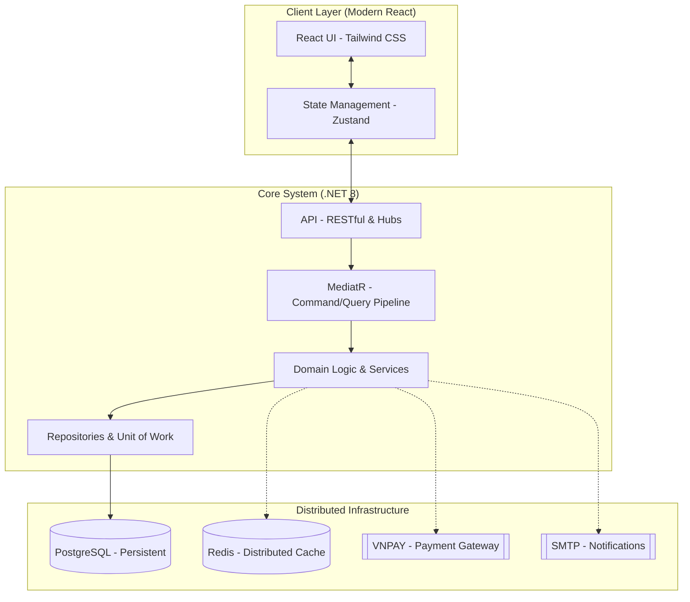

# 🏆 SmartSport - Enterprise-Grade Sports Booking Ecosystem

<div align="center">


**Một giải pháp toàn diện cho việc quản lý và vận hành sân tập thể thao hiện đại, được xây dựng với tư duy kỹ thuật đỉnh cao.**

[Khám phá Tính năng](#-tính-năng-đẳng-cấp) • [Kiến trúc Hệ thống](#-triết-lý-kiến-trúc) • [Công nghệ](#-hệ-sinh-thái-công-nghệ) • [Hướng dẫn Cài đặt](#-quy-trình-triển-khai)

</div>

---

### 🚀 Trạng thái Dự án (Project Status)

> [!IMPORTANT]
> **Hiện tại, dự án đã hoàn thành 100% Core Logic (Backend) và đang trong giai đoạn tối ưu hóa giao diện (UI Development).**
> - ✅ Backend API: Hoàn thiện (Clean Architecture, DDD, CQRS).
> - 🏗️ Frontend: Đang triển khai các Dashboard phức tạp dành cho Admin và Owner.
> - 🧪 Testing: Đang mở rộng độ bao phủ Unit Test cho các Domain Services.

---

## 🔥 Tính năng Đẳng cấp (Premium Features)

SmartSport không chỉ là một ứng dụng đặt sân, đây là một hệ sinh thái được tối ưu cho hiệu suất kinh doanh:

*   **🤖 Smart Intelligence**: Tích hợp thuật toán gợi ý sân (Recommendation Engine) dựa trên tần suất tập luyện, loại sân yêu thích và vị trí địa lý của người dùng.
*   **⚡ Real-time Synchronization**: Sử dụng **SignalR** để đảm bảo trạng thái sân (Available/Occupied/Locked) được cập nhật tức thời trên mọi thiết bị.
*   **💰 Dynamic Pricing Engine**: Hệ thống tự động tính toán giá dựa trên các tham số biến thiên: Giờ vàng (Peak hours), Ngày lễ, và các chiến dịch khuyến mãi tự động.
*   **🛡️ Distributed Locking & Concurrency**: Giải quyết triệt để vấn đề "double booking" bằng kỹ thuật xử lý đồng thời (Concurrency Control) ở mức Database và Application.
*   **🔄 Automated Waitlist**: Khi một khung giờ hot bị hủy, hệ thống tự động thông báo theo thứ tự ưu tiên cho người chơi trong hàng chờ.
*   **💳 Automated Financials**: Tích hợp cổng thanh toán **VNPAY** với quy trình đối soát và hoàn tiền tự động (Automatic Refund) dựa trên chính sách hủy sân linh hoạt.

---

## 🏗️ Triết lý Kiến trúc (Architectural Excellence)

Dự án được xây dựng dựa trên sự kết hợp của những mẫu thiết kế phần mềm kinh điển, đảm bảo khả năng bảo trì và mở rộng trong tương lai.

### 🧩 Phân lớp Kiến trúc (Clean Architecture)
1.  **Domain Layer (Core)**: Chứa các Business Logic thuần túy, không phụ thuộc vào framework. Áp dụng **Rich Domain Model** thay vì Anemic Domain Model.
2.  **Application Layer**: Sử dụng mô hình **CQRS** (MediatR) để tách biệt luồng đọc và ghi dữ liệu, giúp tối ưu hiệu năng và khả năng mở rộng.
3.  **Infrastructure Layer**: Triển khai các dịch vụ kỹ thuật (EF Core, Redis, Payment, Email) theo nguyên lý Dependency Inversion.
4.  **Presentation Layer (Web API)**: Tuân thủ chuẩn RESTful, tích hợp cơ chế Versioning và Swagger Documentation.

### 📊 Hệ thống Luồng dữ liệu (Data Flow)

```mermaid
graph TD
    subgraph "Client Layer (Modern React)"
        UI[React UI - Tailwind CSS]
        State[State Management - Zustand]
    end

    subgraph "Core System (.NET 8)"
        API[API - RESTful & Hubs]
        MediatR[MediatR - Command/Query Pipeline]
        Logic[Domain Logic & Services]
        Repo[Repositories & Unit of Work]
    end

    subgraph "Distributed Infrastructure"
        PG[(PostgreSQL - Persistent)]
        RD[(Redis - Distributed Cache)]
        VN[[VNPAY - Payment Gateway]]
        MAIL[[SMTP - Notifications]]
    end

    UI <--> State
    State <--> API
    API --> MediatR
    MediatR --> Logic
    Logic --> Repo
    Repo --> PG
    Logic -.-> RD
    Logic -.-> VN
    Logic -.-> MAIL
```

---

## 🛠️ Hệ sinh thái Công nghệ (Tech Stack)

### **Backend Mastery**
-   **Core**: .NET 8, C# 12.
-   **Patterns**: CQRS, MediatR, Repository & Unit of Work, Result Pattern.
-   **Database**: PostgreSQL với Entity Framework Core (Code First).
-   **Optimization**: Redis Distributed Caching cho các truy vấn hiệu năng cao.
-   **Validation**: FluentValidation tích hợp sâu vào pipeline xử lý.
-   **Logging**: Serilog cấu hình ghi log có cấu trúc.

### **Frontend Modernization** (In Progress)
-   **Framework**: React 18 + Vite (TypeScript).
-   **UI/UX**: Tailwind CSS, Headless UI, Framer Motion cho các hiệu ứng mượt mà.
-   **State Management**: Zustand (Gọn nhẹ & Hiệu quả).
-   **Data Sync**: TanStack Query (React Query) xử lý server state chuyên nghiệp.

---

## 🧪 Đảm bảo Chất lượng (Engineering Standards)

Dự án chú trọng tuyệt đối vào tính đúng đắn của logic nghiệp vụ:
-   **Unit Testing**: Sử dụng **xUnit**, **FluentAssertions** và **Moq** để kiểm thử các Domain Services phức tạp (Ví dụ: logic tính giá, logic xử lý hàng chờ).
-   **Functional Error Handling**: Không sử dụng Exception cho logic điều khiển, thay vào đó sử dụng **Result Pattern** để code sạch và dễ đoán hơn.
-   **Middleware**: Hệ thống Global Exception Handling và Request Logging đảm bảo tính ổn định 24/7.

---

## 🚀 Quy trình Triển khai

### Prerequisites
- .NET 8 SDK
- Node.js (v18+)
- PostgreSQL & Redis (Local hoặc Docker)

### Installation
1.  **Khởi tạo Backend**:
    ```bash
    cd server/Api
    dotnet ef database update
    dotnet run
    ```
2.  **Khởi tạo Frontend**:
    ```bash
    cd client
    npm install
    npm run dev
    ```

---

## 👨‍💻 Thông tin Tác giả

**Nguyễn Tấn Lợi**
-   **Vị trí**: Full-stack Developer (Specializing in .NET & React)
-   **Định hướng**: Backend Architect / Lead Developer
-   **GitHub**: [@nglowji](https://github.com/nglowji)

---
*Dự án đang trong giai đoạn nước rút để hoàn thiện các module giao diện người dùng cuối. Mọi đóng góp hoặc thắc mắc vui lòng liên hệ qua GitHub Issues.*
