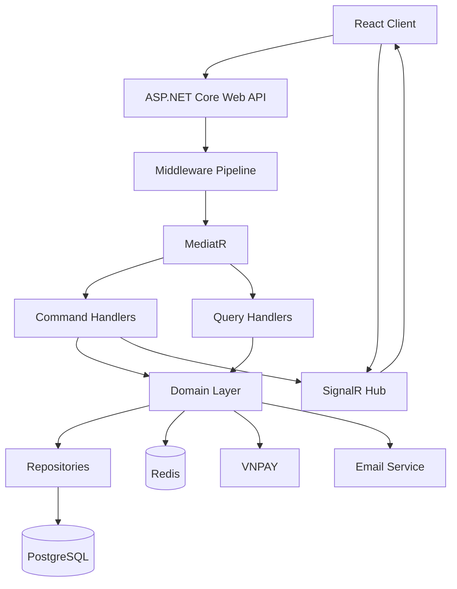
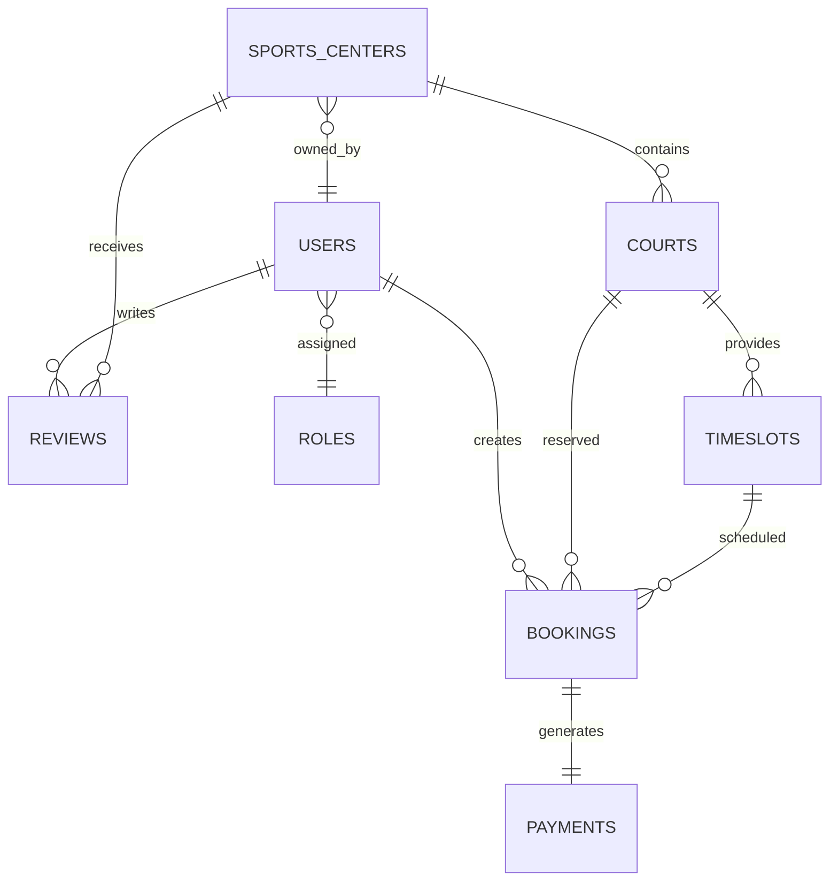
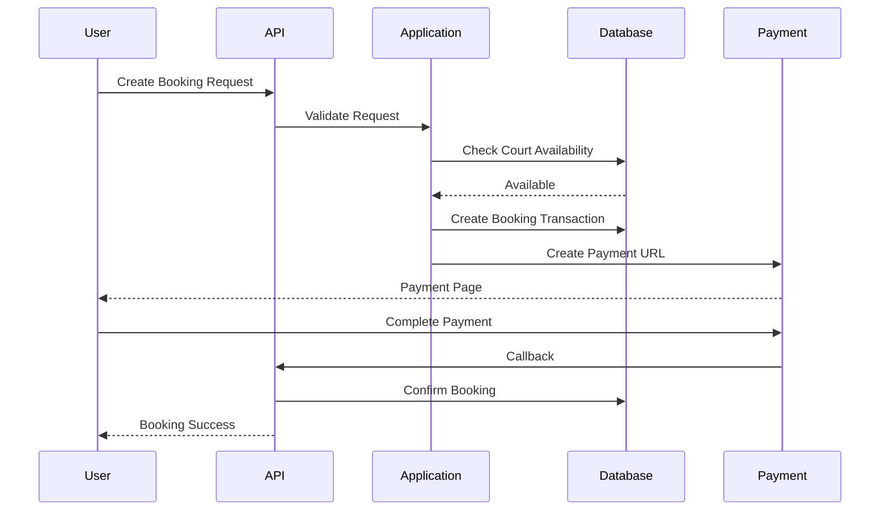

# SmartSport

Sports Booking and Facility Management Platform built with ASP.NET Core (.NET 8), Clean Architecture, Domain-Driven Design (DDD), and CQRS.

## Overview

SmartSport is a sports facility booking platform that allows users to search, book, and manage sports venues while providing administrators and venue owners with tools for facility operations, scheduling, and business management.

The project was developed to apply modern backend engineering practices, scalable architecture principles, and real-world business workflows such as booking management, payment processing, concurrency control, and real-time communication.

## Project Status

| Module                         | Status      |
| ------------------------------ | ----------- |
| Authentication & Authorization | Completed   |
| Venue Management               | Completed   |
| Booking Management             | Completed   |
| Payment Integration            | Completed   |
| Real-Time Notification         | Completed   |
| RESTful API                    | Completed   |
| Frontend Dashboard             | In Progress |
| Automated Testing              | In Progress |

---

# Key Features

## User Features

* User registration and login
* JWT Authentication and Refresh Token
* Search and filter sports venues
* Court booking management
* Booking history tracking
* Online payment via VNPAY
* Real-time booking status updates

## Venue Owner Features

* Sports center management
* Court and schedule configuration
* Booking monitoring
* Revenue overview
* Pricing management

## Administration Features

* User management
* Role and permission management
* Venue approval workflow
* System monitoring

---

# System Architecture

The project follows Clean Architecture principles to ensure maintainability, scalability, and separation of concerns.


```mermaid
flowchart TD
    Client[React Client]

    Client --> API[ASP.NET Core Web API]
    Client --> Hub[SignalR Hub]

    API --> Middleware[Middleware Pipeline]
    Middleware --> MediatR[MediatR]

    MediatR --> Commands[Command Handlers]
    MediatR --> Queries[Query Handlers]

    Commands --> Domain[Domain Layer]
    Queries --> Domain

    Domain --> Repositories[Repositories]
    Repositories --> PostgreSQL[(PostgreSQL)]

    Domain --> Redis[(Redis)]
    Domain --> VNPAY[VNPAY]
    Domain --> Email[Email Service]

    Commands --> Hub
    Hub --> Client
```

---

# Clean Architecture Layers

## Presentation Layer

Responsibilities:

* REST API Endpoints
* SignalR Hubs
* Middleware
* Request/Response Handling

Technologies:

* ASP.NET Core Web API
* Swagger
* SignalR

## Application Layer

Responsibilities:

* CQRS Commands
* CQRS Queries
* DTOs
* Validation
* Business Use Cases

Technologies:

* MediatR
* FluentValidation

## Domain Layer

Responsibilities:

* Entities
* Aggregates
* Value Objects
* Domain Services
* Business Rules

The domain layer contains no dependency on external frameworks.

## Infrastructure Layer

Responsibilities:

* Database Access
* Caching
* Payment Integration
* Email Services
* External Systems

Technologies:

* Entity Framework Core
* PostgreSQL
* Redis
* VNPAY

---

# Database Design

## Core Entities


```mermaid
erDiagram

    USERS ||--o{ BOOKINGS : creates
    USERS ||--o{ REVIEWS : writes
    USERS }o--|| ROLES : assigned

    SPORTS_CENTERS ||--o{ COURTS : contains
    SPORTS_CENTERS ||--o{ REVIEWS : receives
    SPORTS_CENTERS }o--|| USERS : owned_by

    COURTS ||--o{ TIMESLOTS : provides
    COURTS ||--o{ BOOKINGS : reserved

    TIMESLOTS ||--o{ BOOKINGS : scheduled

    BOOKINGS ||--|| PAYMENTS : generates
```

Main entities:

* User
* Role
* SportsCenter
* Court
* TimeSlot
* Booking
* Payment
* Review
* Notification

---

# Booking Workflow

The booking process is designed to prevent double-booking and ensure data consistency.


```mermaid
sequenceDiagram

    participant User
    participant API
    participant Application
    participant Database
    participant Payment

    User->>API: Create Booking Request

    API->>Application: Validate Request

    Application->>Database: Check Court Availability

    Database-->>Application: Available

    Application->>Database: Create Booking Transaction

    Application->>Payment: Create Payment URL

    Payment-->>User: Payment Page

    User->>Payment: Complete Payment

    Payment->>API: Callback

    API->>Database: Confirm Booking

    API-->>User: Booking Success
```

---

# Engineering Decisions

## Why CQRS?

The system separates read and write operations using CQRS.

Benefits:

* Clear separation of responsibilities
* Easier maintenance
* Better scalability
* Independent optimization for queries and commands
* Cleaner business logic

Example:

Query:

```csharp
GetBookingByIdQuery
```

Command:

```csharp
CreateBookingCommand
CancelBookingCommand
ConfirmPaymentCommand
```

---

## Why Redis?

Redis is used to reduce database load and improve response time.

Use Cases:

* Frequently accessed venue data
* Sports center information
* Search results
* Hot booking schedules

Benefits:

* Lower database traffic
* Faster API responses
* Better scalability

---

## Why SignalR?

A booking system requires real-time synchronization.

Without SignalR:

* Users must refresh pages
* Higher risk of outdated data

With SignalR:

* Instant booking updates
* Real-time court status changes
* Notification broadcasting

Example:

When User A books a court, User B immediately sees that slot become unavailable.

---

## How Double-Booking Is Prevented?

Double-booking is one of the most critical problems in booking systems.

The project uses multiple protection layers.

### Validation Layer

Check court availability before creating a booking.

### Database Constraint Layer

Unique constraints ensure the same court and time slot cannot be booked twice.

Example:

```sql
UNIQUE(court_id, timeslot_id, booking_date)
```

### Transaction Layer

Booking creation and payment confirmation are executed inside database transactions.

### Concurrency Control

Optimistic concurrency prevents conflicting updates.

Result:

Even when multiple users attempt to book the same slot simultaneously, only one booking can succeed.

---

# Technology Stack

## Backend

* ASP.NET Core (.NET 8)
* C# 12
* Entity Framework Core
* MediatR
* FluentValidation
* SignalR
* Serilog

## Database

* PostgreSQL
* Redis

## Frontend

* React 18
* TypeScript
* Vite
* Tailwind CSS
* Zustand
* TanStack Query

## Testing

* xUnit
* Moq
* FluentAssertions

## DevOps

* Docker
* GitHub Actions
* Postman
* Swagger

---

# Project Structure

```text
src
├── Api
├── Application
├── Domain
├── Infrastructure
├── Persistence
└── Shared
```

---

# Local Setup

## Prerequisites

* .NET 8 SDK
* Node.js 18+
* PostgreSQL
* Redis

## Backend

```bash
cd server/Api

dotnet ef database update

dotnet run
```

## Frontend

```bash
cd client

npm install

npm run dev
```

---

# Future Improvements

* Recommendation Engine
* Waitlist Management
* Advanced Analytics Dashboard
* Mobile Application
* CI/CD Deployment Pipeline
* Multi-Tenant Architecture

---

# Author

Nguyen Tan Loi

Backend Developer

GitHub: https://github.com/nglowji
